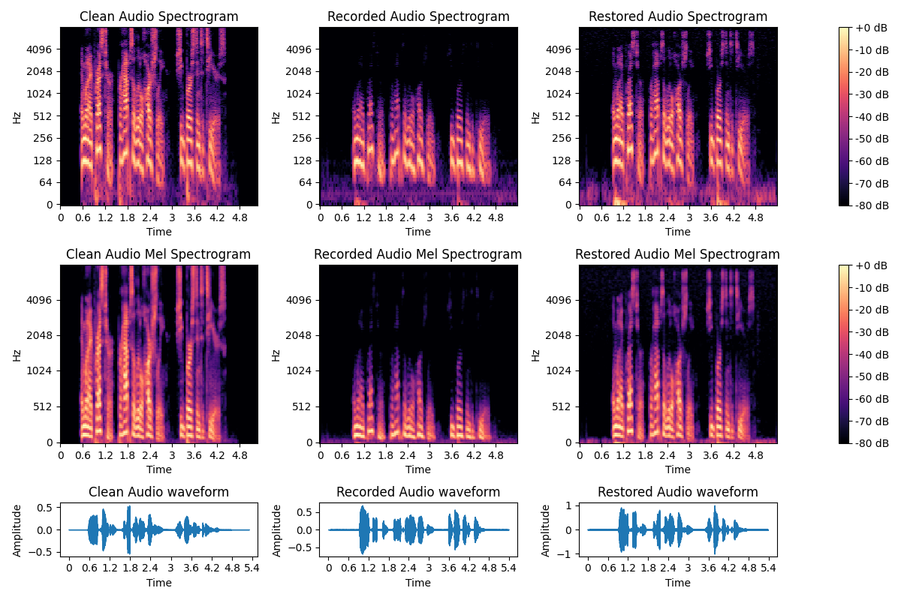

# DTU: HSC 2024

Notes and code for the Helsinki Speech Challenge 2024 work on the Technical University of Denmark.

## 0. Authors

The reposistory was created as a collaboration between the following people of the technical university of Denmark. Ordering is random and not indicative of contribution

- Marie Juhl Jørgensen
- Christian Deding Nielsen
- Søren Vejlgaard Holm
- Karl Meisner-Jensen
- Yue Chang
- Asger Dyregaard
- Kim Knudsen
- Martin Carsten Nielsen

## 1. Description of Methods
Our methods include a mix of model based approaches and neural networks

### Modelling: Impulse Response Inverse filters
First, we recover the Impulse Responses (IRs) using the provided excitation signals with the Energy Decay Curve (EDC) and Energy Time Curve (ETC) methods for each specific level. After that, inverse filters are designed in the frequency domain to restore the frequency attenuation of speech through deconvolution. For the dereverberation part we design the inverse filter as a constrained convex optimization problem based on the impulse response to include prior knowledge of the frequency content in the signal. 


### Neural network: DCCRN model (used in alternative pipeline in task 2 level 1)
DCCRN model (used in alternative pipeline in task 2 level 1):
We finetuned a DCCRN model, which is a Deep Complex Convolution Recurrent Network. For training we used data that had been preprocessed with out inverse impulse response filter. Additionally, synthetic data was made using clean audio from task 1 level 1 and using the impulse response filter. The model was trained for 50 epochs using a spectral convergence loss.

### Neural network: Voicefixer
We used another method based on [voicefixer](https://github.com/haoheliu/voicefixer). This method uses a unet to modify frequencies of input signals first, before passing these to a neural vocoder to create the final denoised signals. Unlike other deep learning methods that used similar methods, we found this to work particularly well for the provided task, which is more an inverse problem than it is an additive noise removal task.

### Methods per level
We mixed the use of the different methods for the individual tasks and levels we found them to work best for. 
- **T1L1-3**: Linear Inverse filter
- **T1L4-7**: Linear Inverse filter + Voicefixer
- **T2L1**: 
1. Spectral subtraction
2. (or alternative pipeline) Tuned DCCRN
- **T2L2-3**: Regularized Linear Inverse filter
- **T3L1**: 
1. T2L2 Regularized Linear Inverse filter + T1L2 Linear Inverse filter
2. (or alternative pipeline) T2L2 Regularized Linear Inverse filter + T1L2 Linear Inverse filter + Voicefixer
- **T3L2**: 
1. T2L3 Regularized Linear Inverse filter + T1L4 Linear Inverse filter
2. (or alternative pipeline) T2L3 Regularized Linear Inverse filter + T1L4 Linear Inverse filter + Voicefixer

## 2. Running the submission
 1. Install the package `dtu_hsc_solutions` from this repository with `pip install -e .` from top-level. 
    This installs many dependencies as well.

 2. Run e.g. `python main.py path/to/input/files path/to/output/files T1L3`. This assumes that the directory `models`
    which is in this reposity is in the current working directory. Otherwise, it can be controlled using the
    `--models-path` argument.

## 3. Resources

- Challenge description: [arxiv.org/abs/2406.04123](https://arxiv.org/abs/2406.04123)
- Challenge website: [blogs.helsinki.fi/helsinki-speech-challenge](https://blogs.helsinki.fi/helsinki-speech-challenge/)
- Challenge data: [zenodo.org/records/11380835](https://zenodo.org/records/11380835)

## 4. Software Setup
Python 3.9 is used because of challenge dependencies (see 5.3 in the challenge description).

The code is divided into different modules which can all be installed by running
```bash
pip install -e .
```
This will also install requirements set by challenge organizers.


The modules are
- `hsc_given_code`: Evaluation code provided for the challenge.
- `dtu_hsc_data` : Data loading, visualization and preprocessing code.
- `dtu_hsc_solutions` : Implementations of the solutions to the challenge.

## 5. Data and Model Setup

1. Select Download all in Zenodo to download all data, then unzip parent and child directories to some directory.

2. Download DeepSpeech model files (for evaluation) in same data path.
```bash
curl -LO https://github.com/mozilla/DeepSpeech/releases/download/v0.9.3/deepspeech-0.9.3-models.pbmm
curl -LO https://github.com/mozilla/DeepSpeech/releases/download/v0.9.3/deepspeech-0.9.3-models.scorer
```

<!--
## 4. Running the Code
You can check the evaluation on the original audio running something like:
```bash
# Handy short-hand to the top-level path of the challenge data and models
export HSC=~/Downloads/hsc
python -m hsc_given_code.evaluate \
    --text_file $HSC/Task_1_Level_1/Task_1_Level_1_text_samples.txt \
    --model_path $HSC/deepspeech-0.9.3-models.pbmm \
    --scorer_path $HSC/deepspeech-0.9.3-models.scorer \
    --audio_dir $HSC/Task_1_Level_1/Recorded
```
Or in a powershell terminal:
```python -m hsc_given_code.evaluate --text_file data/Task_2_Level_1/Task_2_Level_1/Task_2_Level_1_text_samples.txt --model_path data/deepspeech-0.9.3-models.pbmm --scorer_path data/deepspeech-0.9.3-models.scorer --audio_dir data/Task_2_Level_1/Task_2_Level_1/Recorded```

Here, I see an average CER of 4.3%.

and you can try an example solution (Wiener filtering):
```bash
# Runs the speech enhancement "solution"
python -m dtu_hsc_solutions $HSC wiener
# and then evaluate
python -m hsc_given_code.evaluate \
    --text_file $HSC/Task_1_Level_1/Task_1_Level_1_text_samples.txt \
    --model_path $HSC/deepspeech-0.9.3-models.pbmm \
    --scorer_path $HSC/deepspeech-0.9.3-models.scorer \
    --audio_dir $HSC/output/wiener/Task_1_Level_1
```
It displays mean CER = 10.3%: even worse than simply running the original audio - there is work to do!
-->
