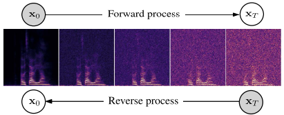
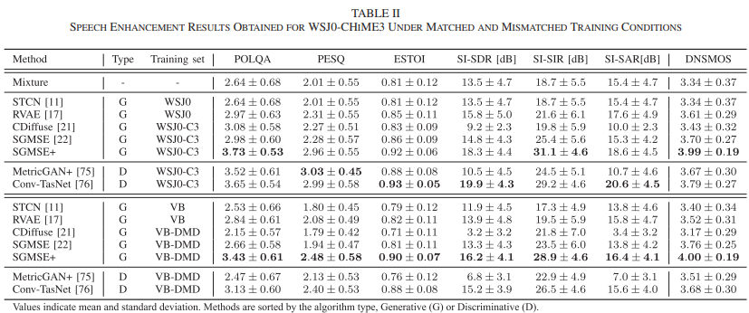
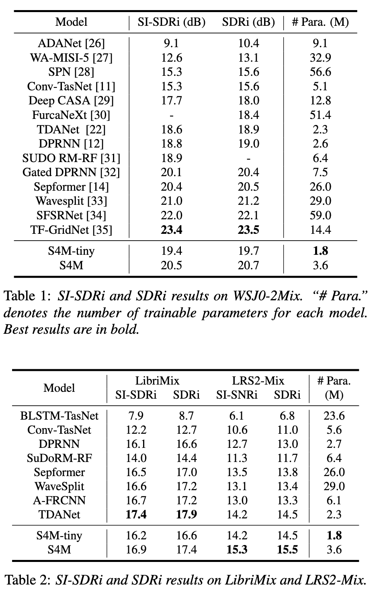

- 
- From 

[A Recursive Network with Dynamic Attention for Monaural Speech Enhancement](https://arxiv.org/abs/2003.12973)
- Github available with pipeline for training, dynamic attention and recursive, major noise reduction network, separated sub-network, which adaptively generates the attention distribution to control the information flow throughout the major network.
- From 2020

[Speech Enhancement and Dereverberation With Diffusion-Based Generative Models](https://ieeexplore.ieee.org/stampPDF/getPDF.jsp?tp=&arnumber=10149431&ref=)
- Diffusion, reverse process from mix of noisy speech and gaussian noise, 30 diffusion steps
- Represent data in the complex-valued STFT domain
- From 2023
- [Github available (with pretrained model)](https://github.com/sp-uhh/sgmse)
- 
- 

[A Neural State-Space Model Approach to Efficient Speech Separation](https://arxiv.org/pdf/2305.16932)
- Fewer parameters than previous
- From 2023
- [Github available](https://github.com/JusperLee/S4M)

[Tiny-Sepformer: A Tiny Time-Domain Transformer Network for Speech Separation](https://arxiv.org/pdf/2206.13689)
- Transformers, computationally optimized (reduced parameters and memory consumption)
- From 2022

[ATTENTION IS ALL YOU NEED IN SPEECH SEPARATION](https://arxiv.org/pdf/2010.13154)
- Transformers
- Multiple models available on hugging face
- From 2021