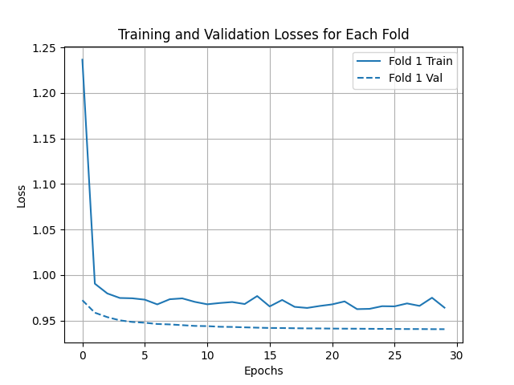

### Out of the box DCCRNet
DCCRN out of the box on task_1_level_4 has mean CER 0.86.

DCCRN out of the box on task_1_level_7 has mean CER 0.95.

DCCRN out of the box on task_2_level_2 has mean CER 0.63.

DCCRN out of the box on task_2_level_3 has mean CER 0.69.

DCCRN out of the box on task_3_level_1 has mean CER 0.99.

Task_2_level_1: Just IR-reconstructed data from task_2_level_1 has a mean CER of 0.47

Task_2_level_1: Using IR-reconstructions as input to the DCCRNet (out of the box) gets mean CER of 0.41.

### Initial finetuning
From a small training of 10 epochs on non-aligned data, these losses where computed:

From a small training of 100 epochs on naive-aligned data, these losses where computed. The mean CER was 0.7

From a small training of 100 epochs on data run through the linear filter first (is the alignment then crosscorrelation or still naive?), these losses where computed. The mean CER was 0.72. Seems the sentences are good, but cut off to soon. Maybe issue with alignment:

### Finetune with aligned data
DCCRN finetuned for 100 epochs on task_2_level_1 with aligned data (through cross-correlation) has mean CER of 0.53

DCCRN finetuned for 100 epochs on task_2_level_1 with aligned data (through cross-correlation) run through IR has mean CER of 0.81

DCCRN finetuned for 100 epochs on task_2_level_1 with aligned + IR data using a Scale-Invariant Signal-to-Distortion-Ratio (SI-SDR) as loss function has mean CER of 0.52

DCCRN finetuned for 100 epochs on task_2_level_1 with aligned + IR data using a Scale-Invariant Signal-to-Distortion-Ratio (SI-SDR) as loss function and only training the decoder of the model has mean CER of 0.5221230

DCCRN finetuned for 100 epochs on task_2_level_1 with aligned + IR data using a spectral convergence loss as loss function has mean CER of 0.13. (using aligned and spec loss and only training decoder got same score)

DCCRN finetuned for 100 epochs on task_2_level_1 with aligned + IR data using a combination of Scale-Invariant Signal-to-Distortion-Ratio (SI-SDR) and spectral convergence as loss function has mean CER of 0.52

DCCRN finetuned for 30 epochs on task_2_level_1 with aligned data using a spectral convergence loss as loss function has mean CER of 0.20

30 epochs trained on task_2_level_2 had CER of 0.557
30 epochs trained on task_2_level_3 had CER of 0.657

30 epochs trained on all of task 2 had CER:
task_2_level_1: 0.207
task_2_level_2: 0.557
task_2_level_3: 0.657

To test:
USing spectral subtraction before or after model
Change window size in loss function
align signals better
Normalize signals

DCCRN on all task1 level 1-5 evaluated on T1L4 with 0.41, on T1L5 with IR 0.536.

With extra data training just on each level gives 0.43 for T1L4 with IR and 0.57 for T1L5 with IR.